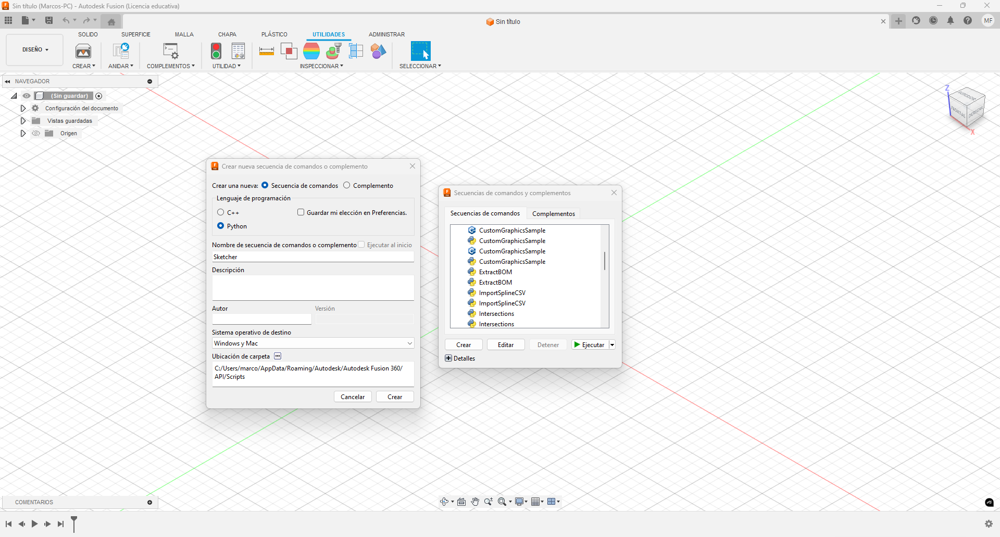

# FUSION360 CSV Sketcher

## Overview

This script helps streamline the CAD design process for the [OpenRED](https://github.com/marcosflz/OpenRED) project by allowing users to automatically create sketches in Fusion 360 from CSV files exported by this module. You can find examples of these CSV files in the project's "Sketches" folder.

## Installation

To use this script in Fusion 360, you need to add it to the "Add-ins" section by following the appropriate command sequence.

